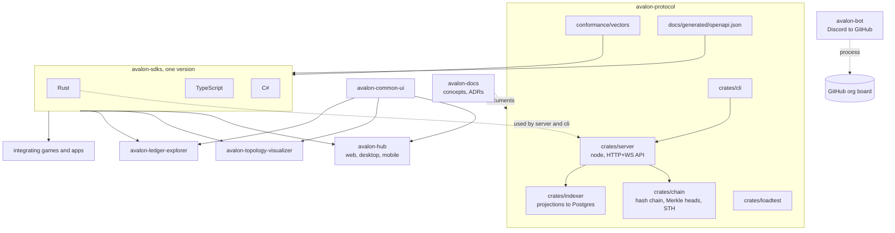

# Architecture As Built

**Status:** Implemented — describes the repositories and crates as they exist; planned parts are not drawn.

How the repositories and the `avalon-protocol` crates depend on each other today, and where the contracts flow. For the invariants and boundaries the system is held to, see the [architecture overview](overview.md); for the repository roles, see the [ecosystem](../ecosystem/README.md).

## Repositories and crates

- **Contracts flow down.** The OpenAPI document and the conformance vectors are generated and kept in `avalon-protocol`; the SDKs are generated from the first and checked against the second. Nothing flows back up except a request for a contract change.
- **The node uses the Rust SDK.** `server` and `cli` depend on the Rust SDK from `avalon-sdks` (tracking its main branch until pinned to a release), so the protocol repository consumes an SDK it also defines the contract for.
- **Crates.** `protocol` holds shared domain types with no I/O and is used by every other crate (not drawn). `chain` and `indexer` are the settlement ledger and the rebuildable read model; `server` is the node; `cli` is local dev and ops tooling; `loadtest` is an isolated load generator; `devenv` only loads the workspace `.env`.
- **Consumers.** The hub, topology visualizer, and ledger explorer each use the TypeScript SDK and `avalon-common-ui`.

## Related

- [Architecture overview](overview.md), [ecosystem](../ecosystem/README.md)
- [Settlement](settlement.md), [query and indexing](query-and-indexing.md)
- [SDK overview](../sdk/README.md), [API specification](../protocol/api.md)
