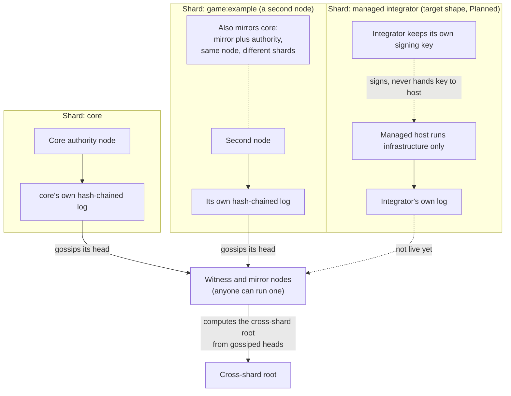
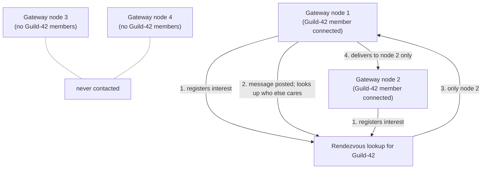

# Distributed Topology

**Status:** Partially implemented — sharded settlement and interest-scoped realtime relay are live; a second independent witness and managed-hosting shards are not

Avalon separates two distributed problems and keeps them apart, the same hot and durable split the rest of the architecture uses. Settlement is sharded by who is allowed to write; realtime is routed by who is currently listening. They never share a mechanism, and a node can run either, both, or neither.

1. **Settlement:** durable, infrequent, cryptographically verified facts. Sharded by authority, not by load.
2. **Realtime:** frequent, ephemeral-to-warm, never cryptographically verified. Routed by interest, not by authority.

## 1. Settlement: sharded authority, no designated aggregator

- Each shard is authoritative for its own events only, with one legitimate signer per shard, so there is still nothing to referee. The no-consensus reasoning of [ADR 0186](decisions/0186-no-blockchain-validator-consensus-transparency-log-only.md) applies per shard.
- **No node does the gluing.** The cross-shard root is a fixed, public recipe over gossiped shard heads, so any witness computes the identical result independently. Losing any one witness changes nothing, and there is no privileged aggregator role to lose. Today one node computes it live in the reference deployment; the property is a design invariant of the recipe, not yet demonstrated by a second, independent witness that agrees.
- A shard operator can be the integrator itself, or a managed host running infrastructure on its behalf, with the signing key never leaving the integrator either way. Managed shards are Planned in production; the mechanism exists ([managed shard hosting](self-hosting/managed-shard-hosting.md)).
- A witness's check is not just "does the math match". It also confirms each contributing shard's head is signed by a key actually authorized for that shard ([network trust anchors](../protocol/network-trust-anchors.md)), catching a consistent-but-unauthorized shard.
- One node can hold both roles for different shards: it can mirror `core` while authoring its own shard ([nodes](nodes/README.md#a-nodes-three-configuration-axes-are-independent)).
- A witness does not need to be told in advance which shards exist. It learns of them through the same bounded peer mesh a node already maintains ([sharding](settlement/sharding.md#automatic-shard-discovery)). Discovery changes only how a witness finds out what to check, not who is authoritative or how trust is verified.

The recipe is in [sharding and cross-shard commitment](settlement/sharding.md).

## 2. Realtime: interest-scoped mesh, not full broadcast

- A node never needs a directory of every other node, only how to reach the rendezvous lookup for a given guild or conversation, plus whichever peers it is actively exchanging events with.
- Delivery cost scales with how spread out that guild actually is, never with total network size.
- **A libp2p Kademlia DHT is the rendezvous lookup**, not a single Redis-backed box or any other single-point-of-failure design. Kademlia replicates a record across the nodes closest to its key, which is the approach IPFS and similar networks already use. A node registers interest under a hash of the guild-channel or conversation id when its first local subscriber appears and refreshes it periodically while any subscriber remains; there is no explicit deregistration, because a disconnected subscriber's record lapses. A lookup is a get against the same key.
- **Claims are signed and membership is rechecked.** A registered interest carries a signed claim (the identity's event-signing key, binding the identity and the destination URL so a claim cannot be republished under another URL to redirect delivery). The relaying node separately rechecks current membership against its own ledger-derived tables rather than trusting the record.
- **Relay decisions use the lookup.** For channel and conversation events the relay asks the DHT who cares; it falls back to relaying to the whole peer table only for presence (no channel or conversation scope exists to look up) and for a node with no DHT identity. An optional per-operator Redis fast path can sit in front of the lookup as a same-fleet latency shortcut; it is never load-bearing, and an empty or failed check falls through to the DHT.

Status of this half: real for the guild-channel and conversation case, and still evolving for presence and full-scale discovery.

## Overlay next-hop selection

Given a target node, a node forwards to its closest unvisited active neighbor by XOR distance, using the same key space the DHT uses, and falls through to the next candidate when a forward fails, so a node with few neighbors still reaches the target. The rule, its failure reasons, and key derivation are in [topology and tracing](nodes/topology-and-tracing.md#overlay-next-hop-selection).

## Connectivity

How a node is reached (direct, NAT-traversed, relayed, or outbound-only) is a transport property, separate from which shard a node authors or which interests it holds. It never changes settlement authority or realtime routing rules, and a node in any state takes part in both problems as a full node. See [connectivity](nodes/connectivity.md).

## Implementation

Status: Partially implemented. Two independent settlement authorities exist on separate machines with a real cross-shard root; a second independent witness computing the same root and a managed-hosting shard have not been stood up. Realtime fan-out within a process uses an in-process broadcast, relayed across nodes with the DHT lookup above. Code is in the [server crate](https://github.com/avalon-initiative/avalon-protocol/tree/main/crates/server) of avalon-protocol.

## Related

- [Sharding and cross-shard commitment](settlement/sharding.md)
- [Nodes](nodes/README.md)
- [Communication](communication.md)
- [Presence](../protocol/presence.md)
- [Scalability](scalability.md)
