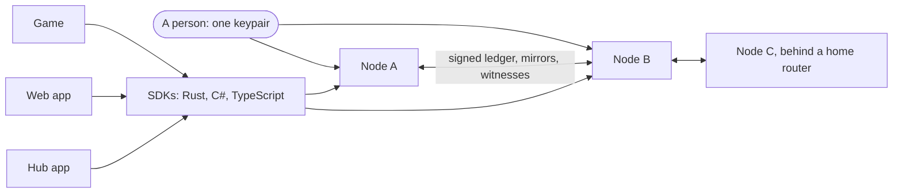

# What is Avalon?

**Status:** Implemented — the identity, social, guild, and attestation layers and the node network exist; economic and portable-asset layers are not built.

Avalon is an open, self-hostable identity and social layer. A person has one persistent identity, one friends list, and one history of guilds and achievements, and carries them between every game, app, and service that chooses to connect. The identity is a keypair the person holds, not an account any company controls.

## The idea in one paragraph

Today every service keeps its own login, friends list, and history, and loses all of it when the service goes away. Avalon moves the durable parts of that (identity, friends, guild membership, verifiable achievements) into a shared network that outlives any one participant. Everything else stays with the integrator: its world, characters, rules, economy, and business model.

An **integrator** is any independently operated game, app, or service that connects to Avalon. Games are the first and best-developed use case, but the same layer serves websites, tools, and community services that want persistent identity and community without owning it outright.

## What Avalon provides

- **Identity.** A self-custodied keypair (a WebAuthn passkey for login and a separate Ed25519 key that signs the events the identity authors). It identifies a keypair, not a person: there is no name, government ID, or biometric anywhere in it. See [identity](../protocol/identity.md).
- **Social graph and presence.** Friends, blocks, and online status stored once at the network level and read by every integrator the person has connected. See [social graph](../protocol/social-graph.md) and [presence](../protocol/presence.md).
- **Guilds.** Communities that exist as network entities, not rows in one game's database, so they outlive any game. See [guilds](../protocol/guilds.md).
- **Attestations.** Signed, verifiable claims ("this issuer says this identity earned this") that a receiving integrator can check and then accept or ignore under its own policy. See [achievements and attestations](../protocol/achievements-and-attestations.md).
- **Capability grants.** An integrator sees only what a person has explicitly granted, and the person can revoke it. See [bindings](../protocol/bindings.md).
- **A signed transparency log.** Durable facts are recorded in an append-only, hash-chained, signed log that anyone can verify and mirror. See [settlement](../architecture/settlement.md).

## How it is built

Three layers:

- **Protocol.** The shared vocabulary and rules every implementation is held to.
- **Network.** Running nodes (`avalon-server`, backed by Postgres) that speak the protocol over HTTP and WebSocket and gossip with each other. See [architecture overview](../architecture/overview.md).
- **Integrators.** Sovereign games, apps, and services that opt into whichever parts they want, usually through an [SDK](../sdk/README.md).

## What Avalon is not

- **Not a blockchain or token.** Settlement is a public, signed, append-only transparency log. There is no validator consensus and no native currency at launch. See [ADR 0186](../architecture/decisions/0186-no-blockchain-validator-consensus-transparency-log-only.md) and [ADR 0070](../architecture/decisions/0070-settlement-is-a-public-transparency-log.md).
- **Not a federation.** Visibility is a property of the public log, not a relationship between servers deciding whether to trust each other.
- **Not a digital-ID system.** Nothing real-world is collected, by construction.
- **Not a platform that owns integrators.** It is not a launcher, store, or ranking authority, and it never decides what one integrator's claims mean to another.
- **Not one universal world or avatar.** Identity is shared; characters stay integrator-specific ([ADR 0067](../architecture/decisions/0067-identity-is-separate-from-game-characters.md)).
- **Planned, not built:** an economic layer (currency, wallet) and portable assets. See [future layers](../architecture/future-layers.md).

## Guiding principles

1. Integrators remain sovereign; Avalon connects them and does not control them.
2. Identity belongs to the person, not to any integrator or company.
3. Interoperability is opt-in.
4. Least privilege: an integrator receives only the capabilities it was granted.
5. History is portable and append-only; revocation is recorded, never erased.
6. A claim need not mean the same thing everywhere it is recognized.
7. Settlement is a public log that anyone can verify and mirror.
8. Open source first; the protocol does not depend on a proprietary implementation.
9. The SDK hides infrastructure, never domain concepts.
10. Build the infrastructure, not the universe.

## Related

- [Why Avalon](why-avalon.md)
- [Concepts](concepts.md)
- [Architecture](../architecture/README.md)
- [Design proposal](../architecture/design-proposal.md)
- [Glossary](../reference/glossary.md)
